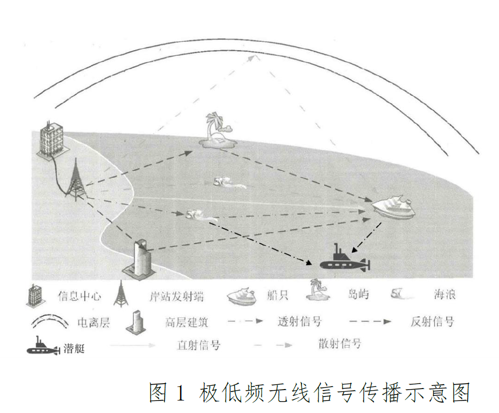

# 
20230212会议纪要

- 专题
  - 空海跨介质长距离
  - 传播机理及信道建模技术
- 技术方案
  - 信道特性测量
  - 信道特性研究
    - 衰落
      - 衰落系数和书中参数进行对比
    - 时延
    - 频率色散
      - 考虑通信带宽内的色散
    - 相干带宽
      - 根据时延得到相关带宽
    - 信道参数相关性
      - 讨论参数之间的相关性
      - 接收到的信号和什么参数相关
      - 电与磁
  - 信道建模
    - 建模方法
      - 信道参数
      - 波导理论、Watterson、基于机器学习的信道泛化与预测、基于神经网络与深度学习的噪声模型分布
      - 噪声模型待探讨
    - 建模平台、信道模拟器
- 测量方法
  - 跟之前老师写的一样
- 磁比较稳定
- 高频和低频
- 成果
- 第一阶段（2023年前）
  - 水深300m内信道模型、测量数据集
- 第二阶段（2025年前）
  - 4个我国近海
- 第三阶段（2027年前）
  - 2个中海
- 第四阶段（2030年前）
  - 远海地区
- 主要技术指标
  - 参数结果与实测数据结果误差不超过20%
- 高频的测量方法/参数，作为低频方法的借鉴
- 测量方案和建模方法还需要细化
- 波形设计需要考虑

# 
待做

- 画图

- 天线的功率
- 高频的测量方法/参数，作为低频方法的借鉴